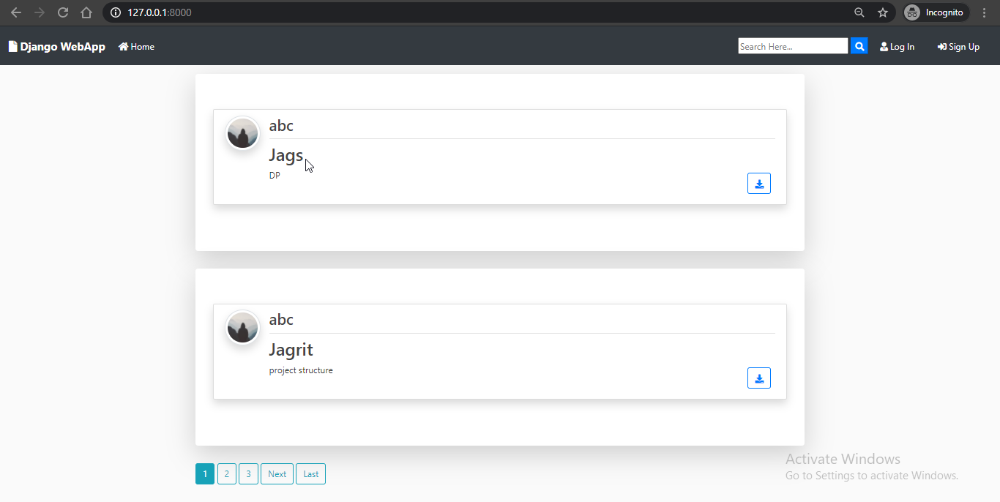

<h1>  We Share </h1>

<h3>Functionalites</h4>
<ol>
     <li>Create a web-app where a user can login.</li>
    <li>User can upload files.</li>
    <li>User can view his/her uploaded files.</li>
     <li>User can search and view profile of other users.</li>
     <li>They can share their uploaded files with any of those users.</li>
     <li>Users can see the shared files by other users also in uploaded files.</li>
</ol>

    
<h2>Additional Python Modules Required:</h2>
<ul>
    <li>Django</li>
    <li>django-crispy-forms</li>
    <li>Pillow</li>
</ul>
 
<h2>How to RUN</h2>

    python django_web_app/manage.py makemigrations

    python django_web_app/manage.py migrate

    python django_web_app/manage.py runserver

# Screenshots : 

